# Enterprise AD + Palo Alto Segmentation Lab

A hands-on homelab simulating a segmented small-business network using Windows Server Active Directory, VLANs, and a Palo Alto VM-Series firewall. Departments were separated into dedicated VLANs and security zones, with the firewall enforcing application-aware access between them.

The lab was validated through controlled connectivity tests, including an HR-to-Server before/after test demonstrating default-deny behavior and explicit firewall policy enforcement.

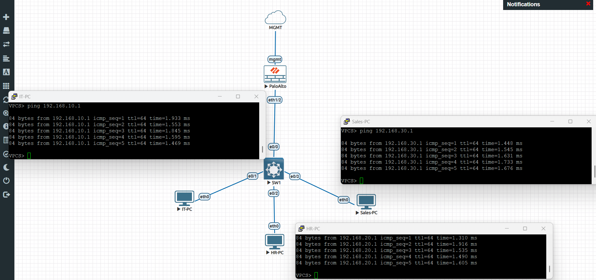

*Figure 1 — EVE-NG topology showing the Palo Alto firewall, switch, departmental endpoints, and server network.*

## Table of Contents

- [Project Overview](#project-overview)
- [Architecture](#architecture)
- [Technologies Used](#technologies-used)
- [Active Directory Configuration](#active-directory-configuration)
- [Network Segmentation](#network-segmentation)
- [Palo Alto Firewall Configuration](#palo-alto-firewall-configuration)
- [Security Policy Design](#security-policy-design)
- [Firewall Validation](#firewall-validation)
- [Troubleshooting](#troubleshooting)
- [Lab Limitations](#lab-limitations)
- [Skills Demonstrated](#skills-demonstrated)
- [Future Improvements](#future-improvements)

## Project Overview

The goal was to build a small, segmented network the way a company might structure it internally: separate departments (IT, HR, Sales), a dedicated server segment, and a security segment, instead of one flat network. A Palo Alto firewall sits at the center as the enforcement point between departments, and Active Directory provides identity and group-based access control on top of that.

All configurations, tests, and troubleshooting results documented below come directly from my homelab environment.

## Architecture

The Palo Alto firewall connects to a virtual switch over an 802.1Q trunk. The switch fans out to the departmental segments, and the firewall routes and enforces policy between them at Layer 3.

| VLAN | Department | Network         | Gateway        | Palo Alto Zone  |
|------|------------|-----------------|----------------|-----------------|
| 10   | IT         | 192.168.10.0/24 | 192.168.10.1   | IT-Zone         |
| 20   | HR         | 192.168.20.0/24 | 192.168.20.1   | HR-Zone         |
| 30   | Sales      | 192.168.30.0/24 | 192.168.30.1   | Sales-Zone      |
| 40   | Servers    | 192.168.40.0/24 | 192.168.40.1   | Server-Zone     |
| 50   | Security   | 192.168.50.0/24 | 192.168.50.1   | Security-Zone   |

The domain controller (DC01) lives in the Server segment at `192.168.40.10`, running the `corp.lab` domain.

## Technologies Used

- **Proxmox VE** — hypervisor hosting the lab
- **EVE-NG** — network emulation for the switch, firewall, and endpoint topology
- **Palo Alto VM-Series NGFW** (PAN-OS 10.0.0) — Layer 3 routing, security zones, security policies
- **Cisco-style virtual switch** — VLAN trunking, 802.1Q
- **Windows Server 2022** — Active Directory Domain Services, DNS
- **Windows 11** — domain-joined client
- **VPCS** — lightweight virtual PCs for department connectivity testing

## Active Directory Configuration

I set up a Windows Server 2022 domain controller and configured:

- The `corp.lab` Active Directory domain, with AD DS and DNS
- Organizational units for **IT**, **HR**, and **Sales**
- Security groups such as `GG_IT_Users` and `GG_HR_Users`
- A Windows 11 client joined to the domain, with domain-account login tested

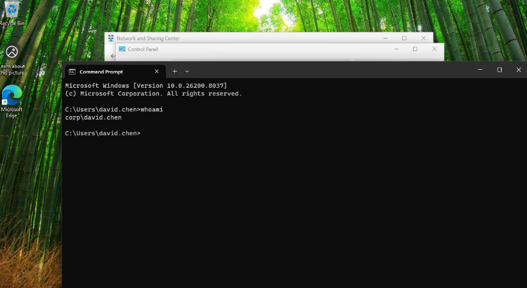

*Figure 2 — `whoami` on the domain-joined Windows 11 client confirming authentication as `corp\david.chen`.*

### File Server & Access Control

I created a `CompanyShare` on the domain controller and set both share-level and NTFS permissions using AD security groups (`GG_IT_Users`, `GG_HR_Users`) rather than assigning rights to individual accounts. This demonstrated group-based access control and the interaction between Windows share and NTFS permissions.

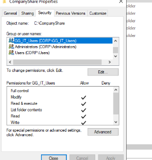

*Figure 3 — NTFS permissions on `CompanyShare` assigned to the `GG_IT_Users` security group.*

## Network Segmentation

Departments were separated into VLANs on the switch, with the Palo Alto firewall handling inter-VLAN routing and enforcement. The switch-to-firewall link was configured as an 802.1Q trunk carrying all five department VLANs; a second trunk toward the server segment carried only the VLANs it needed (10 and 40).

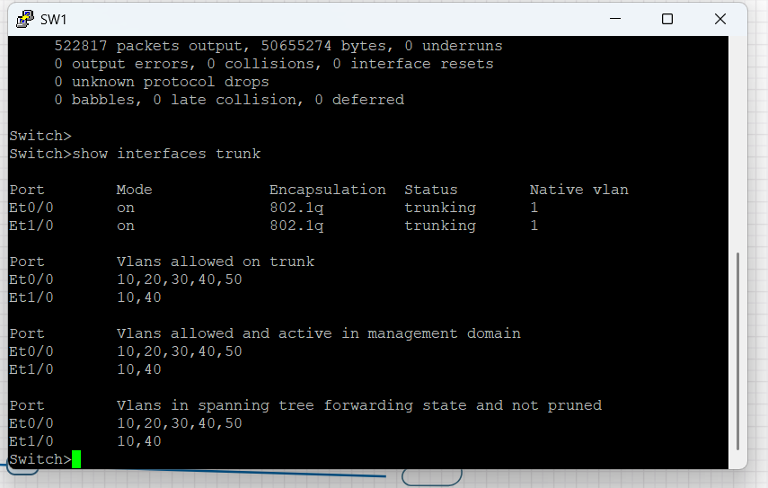

*Figure 4 — Trunk verification confirming VLANs 10, 20, 30, 40, and 50 are trunked to the firewall, with 10 and 40 trunked to the server segment.*

Separating HR onto its own VLAN and zone means HR traffic to other departments has to pass through — and be explicitly permitted by — the firewall, rather than being reachable by default.

## Palo Alto Firewall Configuration

Each VLAN was terminated on its own Palo Alto subinterface (`ethernet1/2.10` through `.50`), with a gateway IP and an assigned security zone per department.

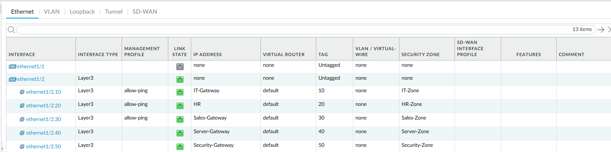

*Figure 5 — Palo Alto subinterfaces, one per VLAN, each mapped to its own security zone.*

With this in place, the firewall — not just the switch — is the actual enforcement boundary between departments.

## Security Policy Design

By default, Palo Alto denies traffic between security zones. Instead of opening that up broadly, I built specific, scoped policies:

- **Allow-IT-to-HR** — `IT-Zone → HR-Zone`, application `ping`, for connectivity testing between those two segments
- **IT-Server** — `IT-Zone → Server-Zone`, scoped to applications associated with Active Directory functionality (DNS, Kerberos, LDAP, SMB/MS-DS-SMBv3, and related AD traffic) rather than `application = any`

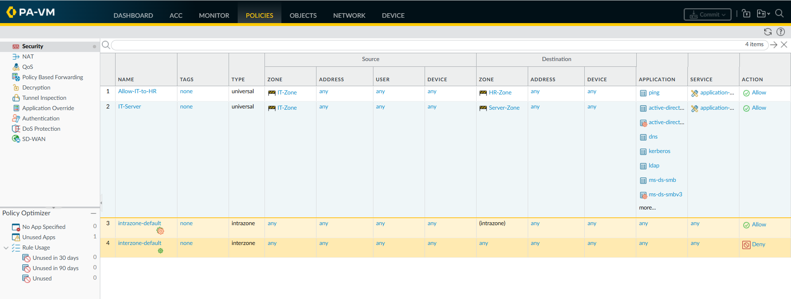

*Figure 6 — Security policy table showing the application-scoped IT → Server rule alongside the default intrazone-allow / interzone-deny rules.*

The intent behind the IT-Server rule was least-privilege policy design: permit the applications associated with AD rather than allowing all traffic between the segments. To validate basic AD service reachability through the policy, I tested TCP connectivity to selected services from an IT host to the domain controller.

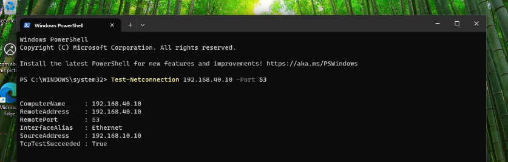

*Figure 7 — TCP connectivity to the domain controller on port 53 verified from IT through the IT-Server policy.*

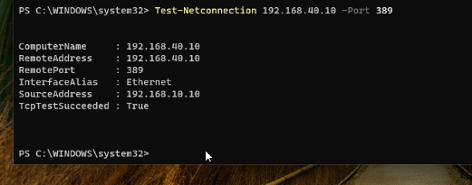

*Figure 8 — TCP connectivity to the domain controller on port 389 (LDAP) verified from IT through the IT-Server policy.*

These tests confirm TCP reachability on the ports checked; they don't represent independent validation of every application listed in the policy.

I also tested the `Allow-IT-to-HR` rule directly by pinging from an IT host to an HR host.

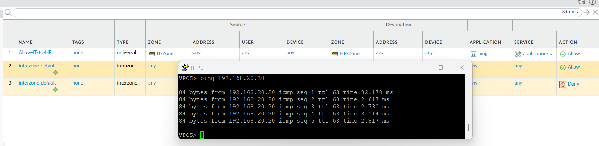

*Figure 9 — Ping from an IT host to the HR host succeeding under the `Allow-IT-to-HR` policy.*

## Firewall Validation

The strongest test in this project is a controlled before/after check of HR-to-Server connectivity, showing the firewall — not the switch or routing alone — decides whether that traffic passes.

**HR-PC:** `192.168.20.20` · **DC01:** `192.168.40.10`

### Before — Default Inter-Zone Behavior

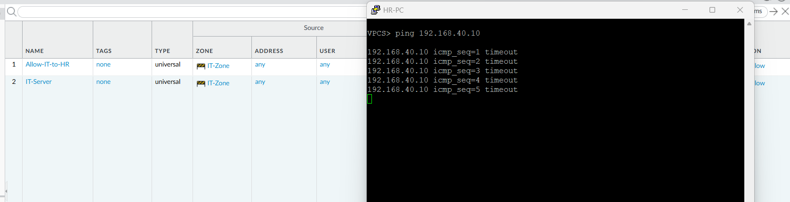

*Figure 10 — Ping from HR-PC to DC01 with no HR → Server allow rule configured.*

With no explicit HR → Server allow rule configured, the traffic was denied under the firewall's default inter-zone behavior. Five consecutive pings timed out.

### After — Explicit Allow Policy

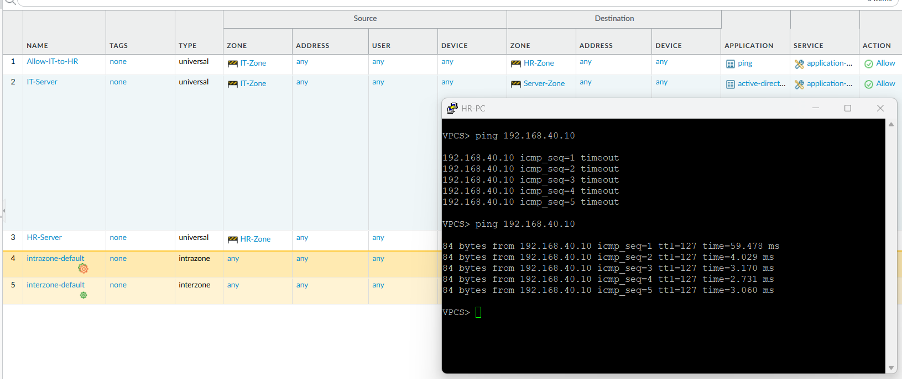

*Figure 11 — Same ping test after committing a temporary `HR-Server` allow policy (`HR-Zone → Server-Zone`, application `ping`, action Allow).*

After committing the policy, the identical ping succeeded immediately. Nothing else in the environment changed between the two tests — only the firewall policy.

This demonstrates the core concept the whole segmentation design rests on: default deny between zones, with access granted only through an explicit, scoped policy. The `HR-Server` rule was created temporarily for this validation and is not part of the intended final access-control design — HR is not meant to have standing access to the server segment.

## Troubleshooting

Most of the real learning in this project happened while diagnosing problems, not during initial setup. VLAN/trunk configuration, firewall zone/policy behavior, and Windows/AD connectivity issues all came up along the way. I also attempted a Palo Alto User-ID integration with Active Directory that I was not able to get working, and encountered a Traffic Monitor logging issue while using an unlicensed PA-VM.

Full write-up, including commands and additional screenshots: [`docs/troubleshooting.md`](docs/troubleshooting.md)

## Lab Limitations

This is a homelab, not a production deployment, and a couple of things didn't fully work:

- **Palo Alto User-ID was attempted but not successfully completed.** I created a dedicated `CORP\palo` service account with the required permissions, confirmed the relevant Windows services were running, and confirmed the firewall could reach the domain controller — but WMI-based server monitoring returned error `0x80010111` and the server never showed as connected. See [`docs/troubleshooting.md`](docs/troubleshooting.md) for details.
- **Traffic Monitor logging was not usable.** The lab firewall is an unlicensed VM-Series instance. Traffic Monitor remained empty despite verifying the log receiver, disk capacity, and session logging settings. The lack of an active VM-Series license was considered a possible contributing factor, but the exact cause was not conclusively isolated. Firewall enforcement itself was confirmed directly through the before/after connectivity test above, independent of this logging issue.
- No Panorama, licensed Threat Prevention, or WildFire was used — this is a segmentation and access-control lab, not a full security-stack deployment.

## Skills Demonstrated

- Windows Server 2022 Active Directory and DNS
- Organizational units, users, and security groups
- Windows domain authentication
- Share and NTFS permission management
- VLAN segmentation and 802.1Q trunking
- Palo Alto VM-Series subinterfaces and security zones
- Inter-VLAN routing and firewall policy enforcement
- Application-aware / least-privilege security policy design
- Default-deny network segmentation
- Connectivity and service validation
- Cross-layer troubleshooting across switching, firewall, Windows, and AD
- Troubleshooting Palo Alto User-ID / WMI integration with Active Directory

## Future Improvements

- Successfully complete Palo Alto User-ID integration, possibly on a newer/licensed PAN-OS deployment
- Add stronger Group Policy configuration for department-specific settings
- Expand least-privilege security policies to the Sales and Security zones
- Explore Microsoft Entra ID / hybrid identity concepts alongside the on-prem AD setup
- Test additional AD service flows beyond DNS and LDAP
- Look at secure remote-access/VPN concepts as a later addition
