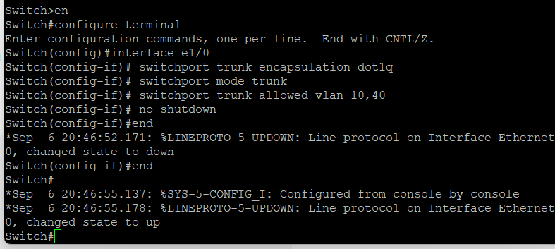

# Troubleshooting Notes

Detailed narrative of the harder problems encountered while building this lab. The main README summarizes these; this doc has the fuller diagnostic path, commands, and supporting screenshots.

## VLAN / Trunk Connectivity

**Problem:** Traffic was not reaching the expected network segment when devices were connected through the switch.

**Investigation:** Because incorrect VLAN membership or trunk pruning can resemble a firewall-policy issue, I verified the switch configuration before continuing firewall troubleshooting. The link toward the Palo Alto firewall was configured to carry all five department VLANs. In this lab, the server-facing trunk was configured to carry VLANs 10 and 40.

```
Switch#configure terminal
Switch(config)#interface e1/0
Switch(config-if)# switchport trunk encapsulation dot1q
Switch(config-if)# switchport mode trunk
Switch(config-if)# switchport trunk allowed vlan 10,40
Switch(config-if)# no shutdown
```



*Configuring the trunk on the server-facing switch interface.*

**Result:** Verified with `show vlan brief` and `show interfaces trunk` that the required VLANs were active and not pruned on each relevant trunk port.

## Firewall Zone / Policy Behavior

**Problem:** Needed to confirm that traffic between departments was actually being controlled by the firewall, not just routed.

**Investigation:** Ran the HR → Server ping test with no explicit allow policy in place (timed out), then created a scoped `HR-Server` allow policy and re-ran the identical test.

**Result:** The ping succeeded only after the explicit policy was committed, with nothing else in the environment changed. Full before/after screenshots are in the main [README](../README.md#firewall-validation).

## Windows / AD Connectivity

**Problem:** Needed to confirm the IT-Server firewall policy actually permitted the Active Directory traffic it was designed for, not just ICMP.

**Investigation:** From an IT host, tested TCP connectivity to the domain controller on specific AD-related ports (53/DNS, 389/LDAP) using `Test-NetConnection`.

**Result:** Both tests reported `TcpTestSucceeded : True`, confirming TCP reachability on those two ports through the policy. This confirms the ports tested — it isn't a full validation of every application listed in the IT-Server rule (Kerberos, SMB, etc.), which were not individually tested with dedicated tools.

## Palo Alto User-ID Integration (Not Completed)

**Goal:** Map Windows domain logons to IP addresses via User-ID, so security policies could eventually reference AD users/groups instead of just IP/zone.

**Setup:**
- Created a dedicated `CORP\palo` service account
- Configured Event Log Readers, WMI permissions, DCOM Remote Launch, and DCOM Remote Activation on the account
- Confirmed RPC and Windows Management Instrumentation services were running on the DC
- Confirmed TCP 135 was listening
- Confirmed basic IP reachability (the Palo Alto could ping the DC)

**Result:** WMI-based server monitoring consistently failed with error `0x80010111`, and the monitored server remained `Not Connected` in the Palo Alto User-ID configuration.

**Assessment:** IP connectivity, service state, and account permissions all checked out. The issue appeared consistent with a WMI/RPC compatibility limitation in the lab environment, but the exact root cause was not conclusively confirmed. User-ID integration is therefore documented as attempted but not completed.

## Traffic Monitor / Logging

**Problem:** `Monitor > Logs > Traffic` remained empty even though security policies were clearly working (confirmed via the before/after connectivity test).

**Investigation:** Checked:
- Log at Session Start / Log at Session End settings on the relevant policies
- interzone-default logging behavior
- Log-receiver process status and log-receiver statistics
- Disk space / log quota
- System time and timezone (see below)
- CLI-based traffic log queries

Also checked licensing: the lab's PA-VM reports `serial: unknown`, and `Device > Licenses` shows no active VM-Series capacity license.

**Result:** The lab used an unlicensed VM-Series instance, and Traffic Monitor remained empty despite verifying the log receiver, disk capacity, session logging settings, and policy enforcement. The lack of an active VM-Series license was identified as a possible contributing factor, but the exact cause was not conclusively isolated.

## Timezone / NTP

While investigating the logging issue, the firewall's clock was found to be about an hour off. It was originally set to US/Pacific and was changed to Canada/Mountain to match Edmonton, but NTP reported `NTP not synched, using local clock`. This was not identified as the cause of the Traffic Monitor issue, but is worth fixing for accurate timestamps in any future log-based troubleshooting.
